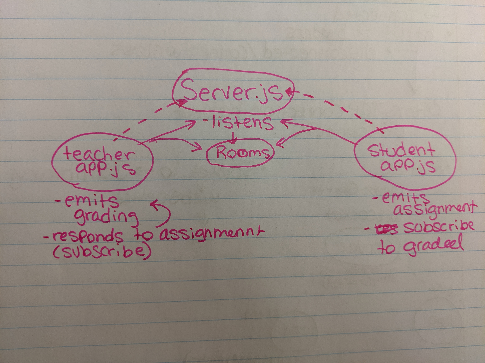

# Lab 18

## Websockets and Socket.io

### Author: Natalie Alway

### Links and Resources
* [submission PR](https://github.com/nataliealway-401-advanced-javascript/lab-18-socket.io/pull/1)
* [travis](https://www.travis-ci.com/nataliealway-401-advanced-javascript/lab-18-socket.io)

#### Documentation
* [jsdoc](https://github.com/nataliealway-401-advanced-javascript/lab-18-socket.io/blob/lab18/docs/global.html)

### Setup
#### `.env` requirements
* `PORT` - 3000

#### Running the app
* Server.js: nodemon server.js
* student.js: nodemon student.js
* instructor.js: nodemon instructor.js  
**To start intervals of assignments being graded**
* app.js: nodemon app.js
  
#### Tests
* `npm test`

#### UML

